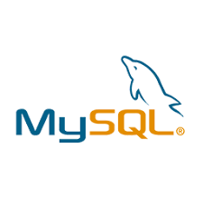

# Cinimatic - Movie Booking Management System

Cinimatic is a comprehensive movie theater booking management system designed to streamline theater operations, movie scheduling, and ticket sales. It provides both admin and customer interfaces for complete theater management.

## Features

- **User Management**: Customer registration, authentication, and profiles
- **Movie Management**: Add/edit/remove movies with details
- **Theater Management**: Manage screening rooms and seating
- **Booking System**: Seat selection and ticket purchasing
- **Admin Dashboard**: Comprehensive analytics and controls

## Technologies Used

  
  
  

### Backend
- Java 11+
- JDBC for database connectivity
- MySQL Database

### Frontend
- Java Swing for GUI
- Custom UI components

### Tools
- Git (version control)
- Figma (UI/UX design)

## Installation

1. **Prerequisites**:
   - Java 
   - MySQL Server 5.7+

## Team members
- Mehdi Benazza  
- Mouzali Rayan  
- Mouhouche Wassim  
- Stambouli
- Djedi Fahd